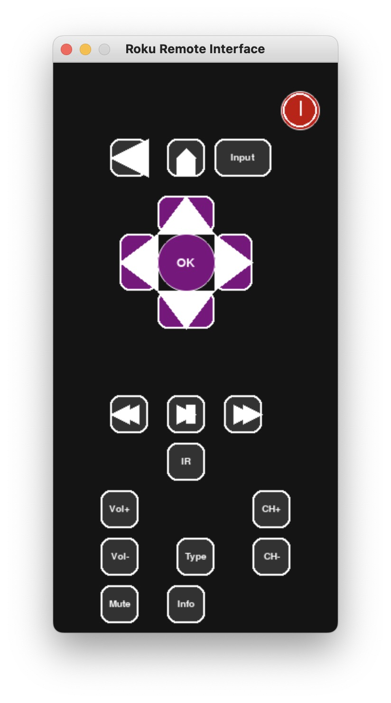

# Custom Roku Remote

A simple Python application to control a Roku TV using ECP-based commands. This is an on-the-side WIP, so feel free to create Issues and/or PRs as they are encountered.

Current support is power on/off, home, back, select+4 direction dpad, select input, pause/play, fast-forward, rewind, volume up/down/mute, channel up/down, type text to tv

## Setup

0. [Download and Install Python](https://www.python.org/downloads/) (e.g., [Python 3.8.8 for Windows](https://www.python.org/ftp/python/3.8.8/python-3.8.8-amd64.exe)). Also, [install git](https://git-scm.com/downloads).

1. Clone the repository (or download and extract the zip file):
   ```
   git clone git@github.com:jhpohovey/simple-remote.git
   ```

2. Navigate to the project directory:
   ```
   cd simple-remote
   ```

3.  Create a virtual environment :
   - On Windows:
     ```sh
     python -m venv venv
     ```
   - On macOS and Linux:
     ```sh
     python3 -m venv venv
     ```

4. [only if you did 3.] Activate the virtual environment:
   - On Windows:
     ```sh
     venv\Scripts\activate
     ```
   - On macOS and Linux:
     ```sh
     source venv/bin/activate
     ```

5. Install the required packages:
   ```sh
   pip install -r requirements.txt
   ```

## GUI Application Usage

1. Run the script with the IP address of your Roku TV:
   ```sh
   python remote_gui.py --ip <ROKU_TV_IP_ADDRESS> --port <ROKU_TV_IP_PORT> 
   ```

2. If no IP address or Port is specified, the default IP address `192.168.50.59` and default port `8060` will be used:
   ```sh
   python remote_gui.py
   ```
   You can also enable logging to act as troubleshooting with `--enable_logging`

3. Use the GUI to control the Roku TV.

## Creating an Executable (note: untested)

1. Create an executable:
   ```sh
   pyinstaller --onefile remote_gui.py
   ```

2. The executable will be generated in the `dist` directory.

3. Run the executable with the IP address of your Roku TV:
   ```sh
   ./dist/remote_gui --ip <ROKU_TV_IP_ADDRESS>
   ```

4. If no IP address is specified, a default IP address will be used:
   ```sh
   ./dist/remote_gui
   ```

5. To enable logging, add the `--enable_logging` flag:
   ```sh
   ./dist/remote_gui --ip <ROKU_TV_IP_ADDRESS> --enable-logging
   ```

## Running on Startup

1. Press `Win + R`, type `shell:startup`, and press Enter.

2. Copy the shortcut of the executable generated by `PyInstaller` to the startup folder.

The application will now run automatically when the computer starts.

## Available Commands

- `powerOn`: Turn on the TV
- `powerOff`: Turn off the TV
- `keyup`: Simulate a keyup event
- `volumeUp`: Increase the volume
- `volumeDown`: Decrease the volume
- `home`: Go to the home screen
- `back`: Go back
- `select`: Select an item
- `up`: Navigate up
- `down`: Navigate down
- `left`: Navigate left
- `right`: Navigate right
- `play`: Play media
- `pause`: Pause media
- `rewind`: Rewind media
- `fastForward`: Fast forward media
- `info`: Show information

Add more commands as needed by extending the `RokuRemote` class.

## Enabling Logging

To enable logging, use the `--enable_logging` flag when running the script:
```sh
python roku_remote.py --ip <ROKU_TV_IP_ADDRESS> --enable_logging
```

You can adjust the logging level manually for further development by modifying the `basicConfig` call in the `roku_remote.py` and `remote_gui.py` files. For example, to set the logging level to `DEBUG`, use:
```python
logging.basicConfig(level=logging.DEBUG)
```

## Modifying the GUI Layout

The GUI layout has been modified to look more like a remote by arranging the buttons in a grid layout and using programmatically created buttons.

By following these steps, you will be able to visualize and interact with a more remote-like GUI for your Roku remote application using `pygame`.

By following these steps, you will be able to create and run a `pygame` GUI for your Roku remote application without needing to provide images. The buttons will be created programmatically.

By following these steps, you will be able to create a circular power button with the power logo on it, along with other rectangular buttons for the rest of the remote functionalities.

## Visual Representation

Below is a basic visual representation of the remote interface. It is quite rudimentary but should accomplish its purpose.



